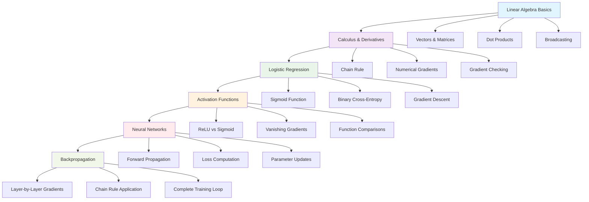

# NN_Foundation 🧠
**A comprehensive, hands-on journey from basic linear algebra to neural networks built from scratch using NumPy**

---

## 📋 Table of Contents
- [Overview & Features](#-overview--features)
- [Architecture & Learning Path](#-architecture--learning-path)
- [Getting Started](#-getting-started)
  - [Prerequisites](#prerequisites)
  - [Installation](#installation)
- [Usage Examples](#-usage-examples)
- [Code Reference](#-code-reference)
- [Learning Modules](#-learning-modules)
- [Contributing](#-contributing)
- [License](#-license)

---

## 🎯 Overview & Features

NN_Foundation is an educational repository designed to provide a solid understanding of neural networks by implementing everything from scratch. This project takes you through a structured learning path, starting from fundamental mathematical concepts to building complete neural networks.

### ✨ Key Features
- **📚 Comprehensive Learning Path**: Six progressive modules covering linear algebra to backpropagation
- **🔬 Hands-on Implementation**: All concepts implemented from scratch using NumPy
- **📊 Visual Learning**: Includes plots, decision boundaries, and loss curves
- **🧪 Practical Examples**: Real datasets (XOR, make_moons) for testing implementations
- **✅ Gradient Verification**: Numerical gradient checking for implementation validation
- **📈 Performance Comparison**: Side-by-side comparison with scikit-learn implementations

### 🎓 What You'll Learn
- Vector operations, matrix multiplication, and broadcasting
- Calculus foundations: derivatives, chain rule, and gradients
- Logistic regression with binary cross-entropy loss
- Activation functions and the vanishing gradient problem
- Neural network architecture and forward/backward propagation
- Complete backpropagation algorithm implementation

---

## 🏗️ Architecture & Learning Path



---

## 🚀 Getting Started

### Prerequisites
- Python 3.7 or higher
- Basic understanding of Python programming
- High school level mathematics (algebra and basic calculus helpful)

### Installation

1. **Clone the repository**
   ```bash
   git clone https://github.com/Yashjain0099/NN_Foundation.git
   cd NN_Foundation
   ```

2. **Create a virtual environment (recommended)**
   ```bash
   python -m venv nn_env
   source nn_env/bin/activate  # On Windows: nn_env\Scripts\activate
   ```

3. **Install required dependencies**
   ```bash
   pip install numpy matplotlib scikit-learn jupyter
   ```

4. **Launch Jupyter Notebook**
   ```bash
   jupyter notebook
   ```

---

## 💻 Usage Examples

### Basic Neural Network Implementation
```python
import numpy as np
from nn_foundation import NeuralNetwork

# Create and train a neural network
nn = NeuralNetwork(input_size=2, hidden_size=4, output_size=1)

# Sample XOR dataset
X = np.array([[0, 0], [0, 1], [1, 0], [1, 1]])
y = np.array([[0], [1], [1], [0]])

# Train the network
for epoch in range(1000):
    # Forward propagation
    output = nn.forward_propagation(X)
    
    # Compute loss
    loss = nn.compute_loss(output, y)
    
    # Backward propagation
    nn.backward_propagation(X, y, output)
    
    # Update parameters
    nn.update_parameters(learning_rate=0.1)
    
    if epoch % 100 == 0:
        print(f"Epoch {epoch}, Loss: {loss:.4f}")
```

### Gradient Checking Example
```python
from nn_foundation.utils import gradient_check

# Verify your implementation
def f(w):
    return w**2 + 3*w + 1

def df_dw(w):
    return 2*w + 3

# Check gradient at w=2
w = 2.0
analytical_grad = df_dw(w)
numerical_grad = gradient_check(f, w)

print(f"Analytical gradient: {analytical_grad}")
print(f"Numerical gradient: {numerical_grad}")
print(f"Difference: {abs(analytical_grad - numerical_grad)}")
```

---

## 📖 Code Reference

### Core Modules

| Module | Description | Key Functions |
|--------|-------------|---------------|
| `linear_algebra.py` | Vector and matrix operations | `dot_product()`, `matrix_multiply()`, `broadcast_example()` |
| `calculus.py` | Derivative computations | `numerical_derivative()`, `gradient_check()` |
| `logistic_regression.py` | Logistic regression implementation | `sigmoid()`, `compute_cost()`, `gradient_descent()` |
| `activation_functions.py` | Neural network activations | `relu()`, `tanh()`, `softmax()`, `derivatives()` |
| `neural_network.py` | Complete NN implementation | `forward_propagation()`, `backward_propagation()` |
| `backpropagation.py` | Backprop algorithm | `compute_gradients()`, `update_parameters()` |

### Main Classes

```python
class NeuralNetwork:
    """Complete neural network implementation from scratch"""
    
    def forward_propagation(self, X):
        """Forward pass through the network"""
        pass
    
    def backward_propagation(self, X, y, output):
        """Compute gradients using backpropagation"""
        pass
    
    def update_parameters(self, learning_rate):
        """Update weights and biases using gradients"""
        pass
```

---

## 📚 Learning Modules

### Module 1: Linear Algebra Foundations

- Vector operations and dot products
- Matrix multiplication (manual vs NumPy)
- Broadcasting concepts and examples

### Module 2: Calculus & Derivatives

- Derivative computation and verification
- Numerical vs analytical gradients
- Chain rule implementation

### Module 3: Logistic Regression

- Sigmoid function implementation
- Binary cross-entropy loss
- Decision boundary visualization

### Module 4: Activation Functions

- ReLU, Sigmoid, Tanh, Softmax
- Vanishing gradient problem demonstration
- Function and gradient comparisons

### Module 5: Neural Networks

- XOR problem solution
- Forward and backward propagation
- Loss curve visualization

### Module 6: Complete Backpropagation

- make_moons dataset classification
- Gradient verification
- Training progress visualization

---

## 🤝 Contributing

We welcome contributions to improve NN_Foundation! Here's how you can help:

1. **Fork the repository**
2. **Create a feature branch** (`git checkout -b feature/AmazingFeature`)
3. **Commit your changes** (`git commit -m 'Add some AmazingFeature'`)
4. **Push to the branch** (`git push origin feature/AmazingFeature`)
5. **Open a Pull Request**

### Contribution Guidelines
- Ensure all code includes comprehensive docstrings
- Add unit tests for new functionality
- Include visualization examples where applicable
- Update documentation for new features

---

## 📄 License

This project is licensed under the MIT License - see the [LICENSE](LICENSE) file for details.

---

## 🙏 Acknowledgments

- Inspired by Andrew Ng's Machine Learning Course
- Reference implementations from various deep learning textbooks
- NumPy and matplotlib communities for excellent documentation

---

## 📧 Contact

**Yash Jain** - [@Yashjain0099](https://github.com/Yashjain0099)

Project Link: [https://github.com/Yashjain0099/NN_Foundation](https://github.com/Yashjain0099/NN_Foundation)

---

*Built with ❤️ and NumPy for educational purposes*
